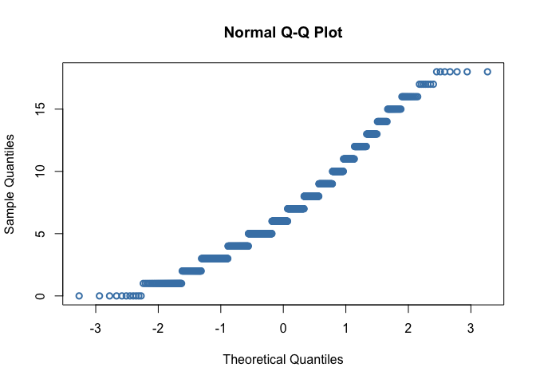
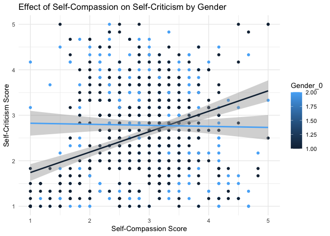

Lab6
================
Nehir Arpat
2024-10-10

# Load Packages

``` r
library(haven)
library(dplyr)
```

    ## 
    ## Attaching package: 'dplyr'

    ## The following objects are masked from 'package:stats':
    ## 
    ##     filter, lag

    ## The following objects are masked from 'package:base':
    ## 
    ##     intersect, setdiff, setequal, union

``` r
library(tidyr)
library(ggplot2)
library(psych)
```

    ## 
    ## Attaching package: 'psych'

    ## The following objects are masked from 'package:ggplot2':
    ## 
    ##     %+%, alpha

``` r
library(bruceR)
```

    ## 
    ## bruceR (v2024.6)
    ## Broadly Useful Convenient and Efficient R functions
    ## 
    ## Packages also loaded:
    ## ✔ data.table ✔ emmeans
    ## ✔ dplyr      ✔ lmerTest
    ## ✔ tidyr      ✔ effectsize
    ## ✔ stringr    ✔ performance
    ## ✔ ggplot2    ✔ interactions
    ## 
    ## Main functions of `bruceR`:
    ## cc()             Describe()  TTEST()
    ## add()            Freq()      MANOVA()
    ## .mean()          Corr()      EMMEANS()
    ## set.wd()         Alpha()     PROCESS()
    ## import()         EFA()       model_summary()
    ## print_table()    CFA()       lavaan_summary()
    ## 
    ## For full functionality, please install all dependencies:
    ## install.packages("bruceR", dep=TRUE)
    ## 
    ## Online documentation:
    ## https://psychbruce.github.io/bruceR
    ## 
    ## To use this package in publications, please cite:
    ## Bao, H.-W.-S. (2024). bruceR: Broadly useful convenient and efficient R functions (Version 2024.6) [Computer software]. https://CRAN.R-project.org/package=bruceR

``` r
library(ggsci)
library(see)
```

    ## 
    ## Attaching package: 'see'

    ## The following objects are masked from 'package:ggsci':
    ## 
    ##     scale_color_material, scale_colour_material, scale_fill_material

``` r
library(car)
```

    ## Loading required package: carData

    ## 
    ## Attaching package: 'car'

    ## The following object is masked from 'package:psych':
    ## 
    ##     logit

    ## The following object is masked from 'package:dplyr':
    ## 
    ##     recode

``` r
library(readr)
library(ggstatsplot)
```

    ## You can cite this package as:
    ##      Patil, I. (2021). Visualizations with statistical details: The 'ggstatsplot' approach.
    ##      Journal of Open Source Software, 6(61), 3167, doi:10.21105/joss.03167

``` r
library(performance)
library(sjPlot)
```

    ## Install package "strengejacke" from GitHub (`devtools::install_github("strengejacke/strengejacke")`) to load all sj-packages at once!

``` r
library(emmeans)
```

# Load Datasets

``` r
dataset <- read_csv("~/Documents/GitHub/Research/Data file Einstein.csv")
```

    ## Rows: 951 Columns: 86
    ## ── Column specification ────────────────────────────────────────────────────────
    ## Delimiter: ","
    ## chr  (2): RecordedDate_0, Origin_0
    ## dbl (84): Number_Order, Age, Gender_0, Australian_0, SCAS_1_0, SCAS_2_0, SCA...
    ## 
    ## ℹ Use `spec()` to retrieve the full column specification for this data.
    ## ℹ Specify the column types or set `show_col_types = FALSE` to quiet this message.

# Unnecessary Data

``` r
# Deleting Origin data
dataset <- dataset %>% select(-Origin_0)

# I don't need the origins of participants and because most are Australian, it is marked NA. 
# I can't perform listwise deletion otherwise.
```

# Missing Data

``` r
#Listwise deletion
list_dataset<- drop_na(dataset)

#pair wise deletion will only be used when you run the actual analysis using "na.rm = TRUE"
```

# Get Summary Descriptive Statistics

``` r
list_dataset %>% 
  group_by(Gender_0) %>%
  dplyr::summarize(mean_SCAS    = mean(SCAS_TOTAL_0),
      mean_SCS    = mean(SCS_Total_0),
      std_dev_SCAS = sd(SCAS_TOTAL_0),
      std_dev_SCs = sd(SCS_Total_0),
      corr_SCAS_  = cor(SCAS_TOTAL_0, SCS_Total_0)
    )
```

    ## # A tibble: 2 × 6
    ##   Gender_0 mean_SCAS mean_SCS std_dev_SCAS std_dev_SCs corr_SCAS_
    ##      <dbl>     <dbl>    <dbl>        <dbl>       <dbl>      <dbl>
    ## 1        1      25.1     3.11         15.4       0.518     -0.443
    ## 2        2      34.3     3.11         17.0       0.614     -0.557

# Normality for Anxiety Scores

``` r
ggplot(list_dataset, aes(x = SCAS_TOTAL_0)) + geom_histogram(binwidth = 2) + theme_classic()
```

<!-- -->

``` r
ggplot(list_dataset, aes(x = SCAS_TOTAL_0)) + geom_density(adjust = 2)  + theme_classic()
```

<!-- -->

``` r
qq<-ggplot(list_dataset, aes(sample = SCAS_TOTAL_0)) + geom_qq()  + theme_classic()

qq+ geom_qq_line()
```

<!-- -->

``` r
#functions below are base R functions, they can do the job, but not as customizable as ggplot

hist(list_dataset$SCAS_TOTAL_0)
```

<!-- -->

``` r
qqnorm(list_dataset$SCAS_TOTAL_0, col = "steelblue", lwd = 2)
```

<!-- -->

``` r
plot(density(list_dataset$SCAS_TOTAL_0, na.rm = TRUE, bw = 90),  lwd=2, main = "")
```

<!-- -->

``` r
describe(list_dataset$SCAS_TOTAL_0)
```

    ##    vars   n  mean    sd median trimmed   mad min max range skew kurtosis   se
    ## X1    1 916 29.38 16.81     26   27.81 14.83   0  98    98 0.91      0.7 0.56

``` r
shapiro.test(list_dataset$SCAS_TOTAL_0)
```

    ## 
    ##  Shapiro-Wilk normality test
    ## 
    ## data:  list_dataset$SCAS_TOTAL_0
    ## W = 0.94619, p-value < 2.2e-16

# Normality for Self-Compassion Scores

``` r
ggplot(list_dataset, aes(x = SCS_Total_0)) + geom_histogram(binwidth = .8) + theme_classic()
```

<!-- -->

``` r
ggplot(list_dataset, aes(x = SCS_Total_0)) + geom_density(adjust = 2)  + theme_classic()
```

<!-- -->

``` r
qq<-ggplot(list_dataset, aes(sample = SCS_Total_0)) + geom_qq()  + theme_classic()

qq+ geom_qq_line()
```

<!-- -->

``` r
#functions below are base R functions, they can do the job, but not as customizable as ggplot

hist(list_dataset$SCS_Total_0)
```

<!-- -->

``` r
qqnorm(list_dataset$SCS_Total_0, col = "steelblue", lwd = 2)
```

<!-- -->

``` r
plot(density(list_dataset$SCS_Total_0, na.rm = TRUE, bw = 90),  lwd=2, main = "")
```

<!-- -->

``` r
describe(list_dataset$SCS_Total_0)
```

    ##    vars   n mean   sd median trimmed mad  min  max range skew kurtosis   se
    ## X1    1 916 3.11 0.56   3.08    3.11 0.5 1.25 4.83  3.58 0.03     0.49 0.02

``` r
shapiro.test(list_dataset$SCS_Total_0)
```

    ## 
    ##  Shapiro-Wilk normality test
    ## 
    ## data:  list_dataset$SCS_Total_0
    ## W = 0.98961, p-value = 4.447e-06

\#Regression for Gender

``` r
model <- lm(SCAS_TOTAL_0 ~ Gender_0 + SCS_Total_0, data = list_dataset)
check_model(model)
```

<!-- -->

``` r
model_summary(model)
```

    ## 
    ## Model Summary
    ## 
    ## ─────────────────────────────
    ##              (1) SCAS_TOTAL_0
    ## ─────────────────────────────
    ## (Intercept)   60.517 ***     
    ##               (2.915)        
    ## Gender_0       9.307 ***     
    ##               (0.926)        
    ## SCS_Total_0  -14.407 ***     
    ##               (0.818)        
    ## ─────────────────────────────
    ## R^2            0.310         
    ## Adj. R^2       0.308         
    ## Num. obs.    916             
    ## ─────────────────────────────
    ## Note. * p < .05, ** p < .01, *** p < .001.
    ## 
    ## # Check for Multicollinearity
    ## 
    ## Low Correlation
    ## 
    ##         Term  VIF  VIF 95% CI Increased SE Tolerance Tolerance 95% CI
    ##     Gender_0 1.00 [1.00, Inf]         1.00      1.00     [0.00, 1.00]
    ##  SCS_Total_0 1.00 [1.00, Inf]         1.00      1.00     [0.00, 1.00]

``` r
tab_model(model)
```

<table style="border-collapse:collapse; border:none;">
<tr>
<th style="border-top: double; text-align:center; font-style:normal; font-weight:bold; padding:0.2cm;  text-align:left; ">
 
</th>
<th colspan="3" style="border-top: double; text-align:center; font-style:normal; font-weight:bold; padding:0.2cm; ">
SCAS_TOTAL_0
</th>
</tr>
<tr>
<td style=" text-align:center; border-bottom:1px solid; font-style:italic; font-weight:normal;  text-align:left; ">
Predictors
</td>
<td style=" text-align:center; border-bottom:1px solid; font-style:italic; font-weight:normal;  ">
Estimates
</td>
<td style=" text-align:center; border-bottom:1px solid; font-style:italic; font-weight:normal;  ">
CI
</td>
<td style=" text-align:center; border-bottom:1px solid; font-style:italic; font-weight:normal;  ">
p
</td>
</tr>
<tr>
<td style=" padding:0.2cm; text-align:left; vertical-align:top; text-align:left; ">
(Intercept)
</td>
<td style=" padding:0.2cm; text-align:left; vertical-align:top; text-align:center;  ">
60.52
</td>
<td style=" padding:0.2cm; text-align:left; vertical-align:top; text-align:center;  ">
54.79 – 66.24
</td>
<td style=" padding:0.2cm; text-align:left; vertical-align:top; text-align:center;  ">
<strong>\<0.001</strong>
</td>
</tr>
<tr>
<td style=" padding:0.2cm; text-align:left; vertical-align:top; text-align:left; ">
Gender 0
</td>
<td style=" padding:0.2cm; text-align:left; vertical-align:top; text-align:center;  ">
9.31
</td>
<td style=" padding:0.2cm; text-align:left; vertical-align:top; text-align:center;  ">
7.49 – 11.12
</td>
<td style=" padding:0.2cm; text-align:left; vertical-align:top; text-align:center;  ">
<strong>\<0.001</strong>
</td>
</tr>
<tr>
<td style=" padding:0.2cm; text-align:left; vertical-align:top; text-align:left; ">
SCS Total 0
</td>
<td style=" padding:0.2cm; text-align:left; vertical-align:top; text-align:center;  ">
-14.41
</td>
<td style=" padding:0.2cm; text-align:left; vertical-align:top; text-align:center;  ">
-16.01 – -12.80
</td>
<td style=" padding:0.2cm; text-align:left; vertical-align:top; text-align:center;  ">
<strong>\<0.001</strong>
</td>
</tr>
<tr>
<td style=" padding:0.2cm; text-align:left; vertical-align:top; text-align:left; padding-top:0.1cm; padding-bottom:0.1cm; border-top:1px solid;">
Observations
</td>
<td style=" padding:0.2cm; text-align:left; vertical-align:top; padding-top:0.1cm; padding-bottom:0.1cm; text-align:left; border-top:1px solid;" colspan="3">
916
</td>
</tr>
<tr>
<td style=" padding:0.2cm; text-align:left; vertical-align:top; text-align:left; padding-top:0.1cm; padding-bottom:0.1cm;">
R<sup>2</sup> / R<sup>2</sup> adjusted
</td>
<td style=" padding:0.2cm; text-align:left; vertical-align:top; padding-top:0.1cm; padding-bottom:0.1cm; text-align:left;" colspan="3">
0.310 / 0.308
</td>
</tr>
</table>

``` r
plot_model(model,  type ="est",  show.values = TRUE, vline.color = "#1B191999", line.size = 1.5, dot.size = 2.5, colors = "blue") + theme_bruce()
```

<!-- -->

# I decided to use a subscale rather than the whole scale. I will fix the other parts accordingly later on bc I have to submit this by tonight.

\#Reliability for Generalized Anxiety Subscale

``` r
bruceR::Alpha(list_dataset, vars=c("SCAS_1_0", "SCAS_3_0", "SCAS_4_0", "SCAS_20_0", "SCAS_22_0", "SCAS_24_0"))
```

    ## 
    ## Reliability Analysis
    ## 
    ## Summary:
    ## Total Items: 6
    ## Scale Range: 0 ~ 3
    ## Total Cases: 916
    ## Valid Cases: 916 (100.0%)
    ## 
    ## Scale Statistics:
    ## Mean = 1.139
    ## S.D. = 0.631
    ## Cronbach’s α = 0.834
    ## McDonald’s ω = 0.837
    ## 
    ## Item Statistics (Cronbach’s α If Item Deleted):
    ## ────────────────────────────────────────────────────
    ##             Mean    S.D. Item-Rest Cor. Cronbach’s α
    ## ────────────────────────────────────────────────────
    ## SCAS_1_0   1.716 (0.785)          0.626        0.804
    ## SCAS_3_0   1.231 (0.952)          0.606        0.809
    ## SCAS_4_0   0.934 (0.692)          0.606        0.810
    ## SCAS_20_0  1.229 (0.927)          0.658        0.796
    ## SCAS_22_0  0.967 (0.868)          0.570        0.815
    ## SCAS_24_0  0.757 (0.869)          0.601        0.808
    ## ────────────────────────────────────────────────────
    ## Item-Rest Cor. = Corrected Item-Total Correlation

\#Reliability for Self-Compassion Subscale

``` r
bruceR::Alpha(list_dataset, vars=c("SCS_2_0", "SCS_3_0", "SCS_5_0", "SCS_6_0", 
  "SCS_7_0", "SCS_10_0"))
```

    ## 
    ## Reliability Analysis
    ## 
    ## Summary:
    ## Total Items: 6
    ## Scale Range: 1 ~ 5
    ## Total Cases: 916
    ## Valid Cases: 916 (100.0%)
    ## 
    ## Scale Statistics:
    ## Mean = 2.859
    ## S.D. = 0.813
    ## Cronbach’s α = 0.816
    ## McDonald’s ω = 0.817
    ## 
    ## Item Statistics (Cronbach’s α If Item Deleted):
    ## ───────────────────────────────────────────────────
    ##            Mean    S.D. Item-Rest Cor. Cronbach’s α
    ## ───────────────────────────────────────────────────
    ## SCS_2_0   2.925 (1.098)          0.566        0.789
    ## SCS_3_0   2.907 (1.084)          0.626        0.777
    ## SCS_5_0   2.769 (1.187)          0.555        0.792
    ## SCS_6_0   2.772 (1.133)          0.553        0.792
    ## SCS_7_0   3.202 (1.158)          0.620        0.777
    ## SCS_10_0  2.578 (1.095)          0.553        0.792
    ## ───────────────────────────────────────────────────
    ## Item-Rest Cor. = Corrected Item-Total Correlation

# Exploratory Factor Analysis for Generalized Anxiety Subscale

``` r
#In factor analysis, using reverse scored items or not does not make a difference in interpretation. If you use unrecoded items, it will just make the loadings negative

EFA(list_dataset, vars=c("SCAS_1_0", "SCAS_3_0", "SCAS_4_0", "SCAS_20_0", "SCAS_22_0", "SCAS_24_0"), method = "pa", plot.scree = TRUE, nfactors = c("parallel"))
```

    ## 
    ## Explanatory Factor Analysis
    ## 
    ## Summary:
    ## Total Items: 6
    ## Scale Range: 0 ~ 3
    ## Total Cases: 916
    ## Valid Cases: 916 (100.0%)
    ## 
    ## Extraction Method:
    ## - Principal Axis Factor Analysis
    ## Rotation Method:
    ## - (Only one component was extracted. The solution was not rotated.)
    ## 
    ## KMO and Bartlett's Test:
    ## - Kaiser-Meyer-Olkin (KMO) Measure of Sampling Adequacy: MSA = 0.863
    ## - Bartlett's Test of Sphericity: Approx. χ²(15) = 1825.82, p < 1e-99 ***
    ## 
    ## Total Variance Explained:
    ## ───────────────────────────────────────────────────────────────────────────────
    ##           Eigenvalue Variance % Cumulative % SS Loading Variance % Cumulative %
    ## ───────────────────────────────────────────────────────────────────────────────
    ## Factor 1       3.308     55.129       55.129      2.772     46.207       46.207
    ## Factor 2       0.730     12.172       67.301                                   
    ## Factor 3       0.582      9.700       77.001                                   
    ## Factor 4       0.520      8.675       85.676                                   
    ## Factor 5       0.435      7.251       92.926                                   
    ## Factor 6       0.424      7.074      100.000                                   
    ## ───────────────────────────────────────────────────────────────────────────────
    ## 
    ## Factor Loadings (Sorted by Size):
    ## ────────────────────────────
    ##              PA1 Communality
    ## ────────────────────────────
    ## SCAS_20_0  0.730       0.533
    ## SCAS_1_0   0.696       0.485
    ## SCAS_3_0   0.675       0.455
    ## SCAS_4_0   0.672       0.451
    ## SCAS_24_0  0.662       0.438
    ## SCAS_22_0  0.640       0.410
    ## ────────────────────────────
    ## Communality = Sum of Squared (SS) Factor Loadings
    ## (Uniqueness = 1 - Communality)

<!-- -->

# Exploratory Factor Analysis for Self-Compassion Subscale

``` r
EFA(list_dataset, vars=c("SCS_2_0", "SCS_3_0", "SCS_5_0", "SCS_6_0", 
  "SCS_7_0", "SCS_10_0"), method = "pa", plot.scree = TRUE, nfactors = c("parallel"))
```

    ## 
    ## Explanatory Factor Analysis
    ## 
    ## Summary:
    ## Total Items: 6
    ## Scale Range: 1 ~ 5
    ## Total Cases: 916
    ## Valid Cases: 916 (100.0%)
    ## 
    ## Extraction Method:
    ## - Principal Axis Factor Analysis
    ## Rotation Method:
    ## - (Only one component was extracted. The solution was not rotated.)
    ## 
    ## KMO and Bartlett's Test:
    ## - Kaiser-Meyer-Olkin (KMO) Measure of Sampling Adequacy: MSA = 0.827
    ## - Bartlett's Test of Sphericity: Approx. χ²(15) = 1666.16, p < 1e-99 ***
    ## 
    ## Total Variance Explained:
    ## ───────────────────────────────────────────────────────────────────────────────
    ##           Eigenvalue Variance % Cumulative % SS Loading Variance % Cumulative %
    ## ───────────────────────────────────────────────────────────────────────────────
    ## Factor 1       3.131     52.190       52.190      2.565     42.749       42.749
    ## Factor 2       0.809     13.479       65.669                                   
    ## Factor 3       0.697     11.623       77.291                                   
    ## Factor 4       0.523      8.713       86.004                                   
    ## Factor 5       0.464      7.734       93.738                                   
    ## Factor 6       0.376      6.262      100.000                                   
    ## ───────────────────────────────────────────────────────────────────────────────
    ## 
    ## Factor Loadings (Sorted by Size):
    ## ───────────────────────────
    ##             PA1 Communality
    ## ───────────────────────────
    ## SCS_3_0   0.716       0.513
    ## SCS_7_0   0.705       0.497
    ## SCS_2_0   0.646       0.417
    ## SCS_6_0   0.617       0.380
    ## SCS_5_0   0.616       0.380
    ## SCS_10_0  0.615       0.378
    ## ───────────────────────────
    ## Communality = Sum of Squared (SS) Factor Loadings
    ## (Uniqueness = 1 - Communality)

<!-- -->
