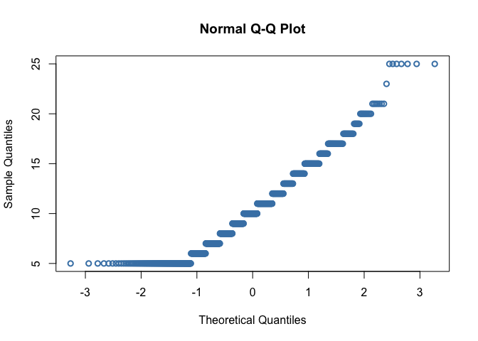

Lab6
================
Nehir Arpat
2024-10-10

# Load Packages

``` r
library(haven)
library(dplyr)
```

    ## 
    ## Attaching package: 'dplyr'

    ## The following objects are masked from 'package:stats':
    ## 
    ##     filter, lag

    ## The following objects are masked from 'package:base':
    ## 
    ##     intersect, setdiff, setequal, union

``` r
library(tidyr)
library(ggplot2)
library(psych)
```

    ## 
    ## Attaching package: 'psych'

    ## The following objects are masked from 'package:ggplot2':
    ## 
    ##     %+%, alpha

``` r
library(bruceR)
```

    ## 
    ## bruceR (v2024.6)
    ## Broadly Useful Convenient and Efficient R functions
    ## 
    ## Packages also loaded:
    ## ✔ data.table ✔ emmeans
    ## ✔ dplyr      ✔ lmerTest
    ## ✔ tidyr      ✔ effectsize
    ## ✔ stringr    ✔ performance
    ## ✔ ggplot2    ✔ interactions
    ## 
    ## Main functions of `bruceR`:
    ## cc()             Describe()  TTEST()
    ## add()            Freq()      MANOVA()
    ## .mean()          Corr()      EMMEANS()
    ## set.wd()         Alpha()     PROCESS()
    ## import()         EFA()       model_summary()
    ## print_table()    CFA()       lavaan_summary()
    ## 
    ## For full functionality, please install all dependencies:
    ## install.packages("bruceR", dep=TRUE)
    ## 
    ## Online documentation:
    ## https://psychbruce.github.io/bruceR
    ## 
    ## To use this package in publications, please cite:
    ## Bao, H.-W.-S. (2024). bruceR: Broadly useful convenient and efficient R functions (Version 2024.6) [Computer software]. https://CRAN.R-project.org/package=bruceR

``` r
library(ggsci)
library(see)
```

    ## 
    ## Attaching package: 'see'

    ## The following objects are masked from 'package:ggsci':
    ## 
    ##     scale_color_material, scale_colour_material, scale_fill_material

``` r
library(car)
```

    ## Loading required package: carData

    ## 
    ## Attaching package: 'car'

    ## The following object is masked from 'package:psych':
    ## 
    ##     logit

    ## The following object is masked from 'package:dplyr':
    ## 
    ##     recode

``` r
library(readr)
```

# Load Datasets

``` r
dataset <- read_csv("~/Documents/GitHub/Research/Data file Einstein.csv")
```

    ## Rows: 951 Columns: 86
    ## ── Column specification ────────────────────────────────────────────────────────
    ## Delimiter: ","
    ## chr  (2): RecordedDate_0, Origin_0
    ## dbl (84): Number_Order, Age, Gender_0, Australian_0, SCAS_1_0, SCAS_2_0, SCA...
    ## 
    ## ℹ Use `spec()` to retrieve the full column specification for this data.
    ## ℹ Specify the column types or set `show_col_types = FALSE` to quiet this message.

# Unnecessary Data

``` r
# Deleting Origin data
dataset <- dataset %>% select(-Origin_0)

# I don't need the origins of participants and because most are Australian, it is marked NA. 
# I can't perform listwise deletion otherwise.
```

# Missing Data

``` r
#Listwise deletion
list_dataset<- drop_na(dataset)

#pair wise deletion will only be used when you run the actual analysis using "na.rm = TRUE"
```

# Normality

``` r
ggplot(list_dataset, aes(x = FoMO_Total)) + geom_histogram(binwidth = 2) + theme_classic()
```

<!-- -->

``` r
ggplot(list_dataset, aes(x = FoMO_Total)) + geom_density(adjust = 2)  + theme_classic()
```

<!-- -->

``` r
qq<-ggplot(list_dataset, aes(sample = FoMO_Total)) + geom_qq()  + theme_classic()

qq+ geom_qq_line()
```

<!-- -->

``` r
#functions below are base R functions, they can do the job, but not as customizable as ggplot

hist(list_dataset$FoMO_Total)
```

<!-- -->

``` r
qqnorm(list_dataset$FoMO_Total, col = "steelblue", lwd = 2)
```

<!-- -->

``` r
plot(density(list_dataset$FoMO_Total, na.rm = TRUE, bw = 90),  lwd=2, main = "")
```

<!-- -->

``` r
describe(list_dataset$FoMO_Total)
```

    ##    vars   n  mean   sd median trimmed  mad min max range skew kurtosis   se
    ## X1    1 916 10.49 4.13     10   10.18 4.45   5  25    20 0.66     0.22 0.14

``` r
shapiro.test(list_dataset$FoMO_Total)
```

    ## 
    ##  Shapiro-Wilk normality test
    ## 
    ## data:  list_dataset$FoMO_Total
    ## W = 0.94634, p-value < 2.2e-16
