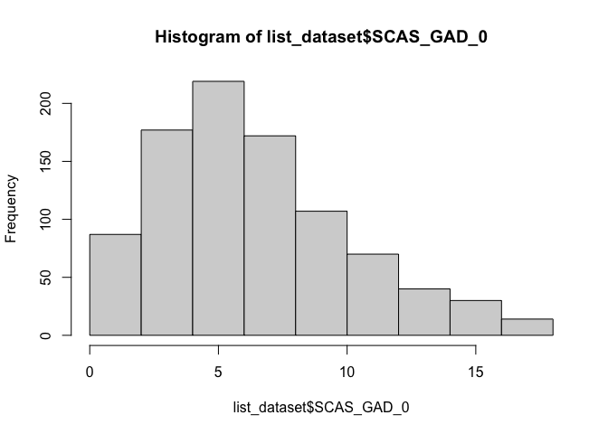

Lab6
================
Nehir Arpat
2024-10-10

# Load Packages

``` r
library(haven)
library(dplyr)
```

    ## 
    ## Attaching package: 'dplyr'

    ## The following objects are masked from 'package:stats':
    ## 
    ##     filter, lag

    ## The following objects are masked from 'package:base':
    ## 
    ##     intersect, setdiff, setequal, union

``` r
library(tidyr)
library(ggplot2)
library(psych)
```

    ## 
    ## Attaching package: 'psych'

    ## The following objects are masked from 'package:ggplot2':
    ## 
    ##     %+%, alpha

``` r
library(bruceR)
```

    ## 
    ## bruceR (v2024.6)
    ## Broadly Useful Convenient and Efficient R functions
    ## 
    ## Packages also loaded:
    ## ✔ data.table ✔ emmeans
    ## ✔ dplyr      ✔ lmerTest
    ## ✔ tidyr      ✔ effectsize
    ## ✔ stringr    ✔ performance
    ## ✔ ggplot2    ✔ interactions
    ## 
    ## Main functions of `bruceR`:
    ## cc()             Describe()  TTEST()
    ## add()            Freq()      MANOVA()
    ## .mean()          Corr()      EMMEANS()
    ## set.wd()         Alpha()     PROCESS()
    ## import()         EFA()       model_summary()
    ## print_table()    CFA()       lavaan_summary()
    ## 
    ## For full functionality, please install all dependencies:
    ## install.packages("bruceR", dep=TRUE)
    ## 
    ## Online documentation:
    ## https://psychbruce.github.io/bruceR
    ## 
    ## To use this package in publications, please cite:
    ## Bao, H.-W.-S. (2024). bruceR: Broadly useful convenient and efficient R functions (Version 2024.6) [Computer software]. https://CRAN.R-project.org/package=bruceR

``` r
library(ggsci)
library(see)
```

    ## 
    ## Attaching package: 'see'

    ## The following objects are masked from 'package:ggsci':
    ## 
    ##     scale_color_material, scale_colour_material, scale_fill_material

``` r
library(car)
```

    ## Loading required package: carData

    ## 
    ## Attaching package: 'car'

    ## The following object is masked from 'package:psych':
    ## 
    ##     logit

    ## The following object is masked from 'package:dplyr':
    ## 
    ##     recode

``` r
library(readr)
library(ggstatsplot)
```

    ## You can cite this package as:
    ##      Patil, I. (2021). Visualizations with statistical details: The 'ggstatsplot' approach.
    ##      Journal of Open Source Software, 6(61), 3167, doi:10.21105/joss.03167

``` r
library(performance)
library(sjPlot)
```

    ## Learn more about sjPlot with 'browseVignettes("sjPlot")'.

``` r
library(emmeans)
```

# Load Datasets

``` r
dataset <- read_csv("~/Documents/GitHub/Research/Data file Einstein.csv")
```

    ## Rows: 951 Columns: 86
    ## ── Column specification ────────────────────────────────────────────────────────
    ## Delimiter: ","
    ## chr  (2): RecordedDate_0, Origin_0
    ## dbl (84): Number_Order, Age, Gender_0, Australian_0, SCAS_1_0, SCAS_2_0, SCA...
    ## 
    ## ℹ Use `spec()` to retrieve the full column specification for this data.
    ## ℹ Specify the column types or set `show_col_types = FALSE` to quiet this message.

# Unnecessary Data

``` r
# Deleting Origin data
dataset <- dataset %>% select(-Origin_0)

# I don't need the origins of participants and because most are Australian, it is marked NA. 
# I can't perform listwise deletion otherwise.
```

# Missing Data

``` r
#Listwise deletion
list_dataset<- drop_na(dataset)

#pair wise deletion will only be used when you run the actual analysis using "na.rm = TRUE"
```

# Get Summary Descriptive Statistics

``` r
list_dataset %>% 
  group_by(Gender_0) %>%
  dplyr::summarize(mean_SCAS    = mean(SCAS_TOTAL_0),
      mean_SCS    = mean(SCS_Total_0),
      std_dev_SCAS = sd(SCAS_TOTAL_0),
      std_dev_SCs = sd(SCS_Total_0),
      corr_SCAS_  = cor(SCAS_TOTAL_0, SCS_Total_0)
    )
```

    ## # A tibble: 2 × 6
    ##   Gender_0 mean_SCAS mean_SCS std_dev_SCAS std_dev_SCs corr_SCAS_
    ##      <dbl>     <dbl>    <dbl>        <dbl>       <dbl>      <dbl>
    ## 1        1      25.1     3.11         15.4       0.518     -0.443
    ## 2        2      34.3     3.11         17.0       0.614     -0.557

# Normality for Anxiety Scores

``` r
ggplot(list_dataset, aes(x = SCAS_TOTAL_0)) + geom_histogram(binwidth = 2) + theme_classic()
```

<!-- -->

``` r
ggplot(list_dataset, aes(x = SCAS_TOTAL_0)) + geom_density(adjust = 2)  + theme_classic()
```

<!-- -->

``` r
qq<-ggplot(list_dataset, aes(sample = SCAS_TOTAL_0)) + geom_qq()  + theme_classic()

qq+ geom_qq_line()
```

<!-- -->

``` r
#functions below are base R functions, they can do the job, but not as customizable as ggplot

hist(list_dataset$SCAS_TOTAL_0)
```

<!-- -->

``` r
qqnorm(list_dataset$SCAS_TOTAL_0, col = "steelblue", lwd = 2)
```

<!-- -->

``` r
plot(density(list_dataset$SCAS_TOTAL_0, na.rm = TRUE, bw = 90),  lwd=2, main = "")
```

<!-- -->

``` r
describe(list_dataset$SCAS_TOTAL_0)
```

    ##    vars   n  mean    sd median trimmed   mad min max range skew kurtosis   se
    ## X1    1 916 29.38 16.81     26   27.81 14.83   0  98    98 0.91      0.7 0.56

``` r
shapiro.test(list_dataset$SCAS_TOTAL_0)
```

    ## 
    ##  Shapiro-Wilk normality test
    ## 
    ## data:  list_dataset$SCAS_TOTAL_0
    ## W = 0.94619, p-value < 2.2e-16

# Normality for Self-Compassion Scores

``` r
ggplot(list_dataset, aes(x = SCS_Total_0)) + geom_histogram(binwidth = 2) + theme_classic()
```

<!-- -->

``` r
ggplot(list_dataset, aes(x = SCS_Total_0)) + geom_density(adjust = 2)  + theme_classic()
```

<!-- -->

``` r
qq<-ggplot(list_dataset, aes(sample = SCS_Total_0)) + geom_qq()  + theme_classic()

qq+ geom_qq_line()
```

<!-- -->

``` r
#functions below are base R functions, they can do the job, but not as customizable as ggplot

hist(list_dataset$SCS_Total_0)
```

<!-- -->

``` r
qqnorm(list_dataset$SCS_Total_0, col = "steelblue", lwd = 2)
```

<!-- -->

``` r
plot(density(list_dataset$SCS_Total_0, na.rm = TRUE, bw = 90),  lwd=2, main = "")
```

<!-- -->

``` r
describe(list_dataset$SCS_Total_0)
```

    ##    vars   n mean   sd median trimmed mad  min  max range skew kurtosis   se
    ## X1    1 916 3.11 0.56   3.08    3.11 0.5 1.25 4.83  3.58 0.03     0.49 0.02

``` r
shapiro.test(list_dataset$SCS_Total_0)
```

    ## 
    ##  Shapiro-Wilk normality test
    ## 
    ## data:  list_dataset$SCS_Total_0
    ## W = 0.98961, p-value = 4.447e-06

\#Regression

``` r
model <- lm(SCAS_TOTAL_0 ~ Gender_0 + SCS_Total_0, data = list_dataset)
check_model(model)
```

<!-- -->

``` r
model_summary(model)
```

    ## 
    ## Model Summary
    ## 
    ## ─────────────────────────────
    ##              (1) SCAS_TOTAL_0
    ## ─────────────────────────────
    ## (Intercept)   60.517 ***     
    ##               (2.915)        
    ## Gender_0       9.307 ***     
    ##               (0.926)        
    ## SCS_Total_0  -14.407 ***     
    ##               (0.818)        
    ## ─────────────────────────────
    ## R^2            0.310         
    ## Adj. R^2       0.308         
    ## Num. obs.    916             
    ## ─────────────────────────────
    ## Note. * p < .05, ** p < .01, *** p < .001.
    ## 
    ## # Check for Multicollinearity
    ## 
    ## Low Correlation
    ## 
    ##         Term  VIF  VIF 95% CI Increased SE Tolerance Tolerance 95% CI
    ##     Gender_0 1.00 [1.00, Inf]         1.00      1.00     [0.00, 1.00]
    ##  SCS_Total_0 1.00 [1.00, Inf]         1.00      1.00     [0.00, 1.00]

``` r
tab_model(model)
```

<table style="border-collapse:collapse; border:none;">
<tr>
<th style="border-top: double; text-align:center; font-style:normal; font-weight:bold; padding:0.2cm;  text-align:left; ">
 
</th>
<th colspan="3" style="border-top: double; text-align:center; font-style:normal; font-weight:bold; padding:0.2cm; ">
SCAS_TOTAL_0
</th>
</tr>
<tr>
<td style=" text-align:center; border-bottom:1px solid; font-style:italic; font-weight:normal;  text-align:left; ">
Predictors
</td>
<td style=" text-align:center; border-bottom:1px solid; font-style:italic; font-weight:normal;  ">
Estimates
</td>
<td style=" text-align:center; border-bottom:1px solid; font-style:italic; font-weight:normal;  ">
CI
</td>
<td style=" text-align:center; border-bottom:1px solid; font-style:italic; font-weight:normal;  ">
p
</td>
</tr>
<tr>
<td style=" padding:0.2cm; text-align:left; vertical-align:top; text-align:left; ">
(Intercept)
</td>
<td style=" padding:0.2cm; text-align:left; vertical-align:top; text-align:center;  ">
60.52
</td>
<td style=" padding:0.2cm; text-align:left; vertical-align:top; text-align:center;  ">
54.79 – 66.24
</td>
<td style=" padding:0.2cm; text-align:left; vertical-align:top; text-align:center;  ">
<strong>\<0.001</strong>
</td>
</tr>
<tr>
<td style=" padding:0.2cm; text-align:left; vertical-align:top; text-align:left; ">
Gender 0
</td>
<td style=" padding:0.2cm; text-align:left; vertical-align:top; text-align:center;  ">
9.31
</td>
<td style=" padding:0.2cm; text-align:left; vertical-align:top; text-align:center;  ">
7.49 – 11.12
</td>
<td style=" padding:0.2cm; text-align:left; vertical-align:top; text-align:center;  ">
<strong>\<0.001</strong>
</td>
</tr>
<tr>
<td style=" padding:0.2cm; text-align:left; vertical-align:top; text-align:left; ">
SCS Total 0
</td>
<td style=" padding:0.2cm; text-align:left; vertical-align:top; text-align:center;  ">
-14.41
</td>
<td style=" padding:0.2cm; text-align:left; vertical-align:top; text-align:center;  ">
-16.01 – -12.80
</td>
<td style=" padding:0.2cm; text-align:left; vertical-align:top; text-align:center;  ">
<strong>\<0.001</strong>
</td>
</tr>
<tr>
<td style=" padding:0.2cm; text-align:left; vertical-align:top; text-align:left; padding-top:0.1cm; padding-bottom:0.1cm; border-top:1px solid;">
Observations
</td>
<td style=" padding:0.2cm; text-align:left; vertical-align:top; padding-top:0.1cm; padding-bottom:0.1cm; text-align:left; border-top:1px solid;" colspan="3">
916
</td>
</tr>
<tr>
<td style=" padding:0.2cm; text-align:left; vertical-align:top; text-align:left; padding-top:0.1cm; padding-bottom:0.1cm;">
R<sup>2</sup> / R<sup>2</sup> adjusted
</td>
<td style=" padding:0.2cm; text-align:left; vertical-align:top; padding-top:0.1cm; padding-bottom:0.1cm; text-align:left;" colspan="3">
0.310 / 0.308
</td>
</tr>
</table>

``` r
plot_model(model,  type ="est",  show.values = TRUE, vline.color = "#1B191999", line.size = 1.5, dot.size = 2.5, colors = "blue") + theme_bruce()
```

<!-- -->
