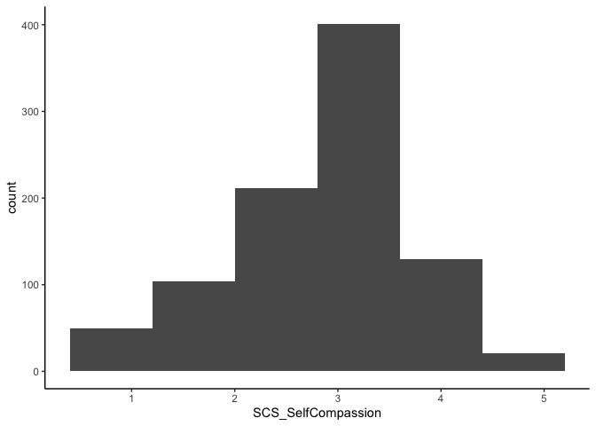

Lab6
================
Nehir Arpat
2024-10-10

# Load Packages

``` r
library(haven)
library(dplyr)
```

    ## 
    ## Attaching package: 'dplyr'

    ## The following objects are masked from 'package:stats':
    ## 
    ##     filter, lag

    ## The following objects are masked from 'package:base':
    ## 
    ##     intersect, setdiff, setequal, union

``` r
library(tidyr)
library(ggplot2)
library(psych)
```

    ## 
    ## Attaching package: 'psych'

    ## The following objects are masked from 'package:ggplot2':
    ## 
    ##     %+%, alpha

``` r
library(bruceR)
```

    ## 
    ## bruceR (v2024.6)
    ## Broadly Useful Convenient and Efficient R functions
    ## 
    ## Packages also loaded:
    ## ✔ data.table ✔ emmeans
    ## ✔ dplyr      ✔ lmerTest
    ## ✔ tidyr      ✔ effectsize
    ## ✔ stringr    ✔ performance
    ## ✔ ggplot2    ✔ interactions
    ## 
    ## Main functions of `bruceR`:
    ## cc()             Describe()  TTEST()
    ## add()            Freq()      MANOVA()
    ## .mean()          Corr()      EMMEANS()
    ## set.wd()         Alpha()     PROCESS()
    ## import()         EFA()       model_summary()
    ## print_table()    CFA()       lavaan_summary()
    ## 
    ## For full functionality, please install all dependencies:
    ## install.packages("bruceR", dep=TRUE)
    ## 
    ## Online documentation:
    ## https://psychbruce.github.io/bruceR
    ## 
    ## To use this package in publications, please cite:
    ## Bao, H.-W.-S. (2024). bruceR: Broadly useful convenient and efficient R functions (Version 2024.6) [Computer software]. https://CRAN.R-project.org/package=bruceR

``` r
library(ggsci)
library(see)
```

    ## 
    ## Attaching package: 'see'

    ## The following objects are masked from 'package:ggsci':
    ## 
    ##     scale_color_material, scale_colour_material, scale_fill_material

``` r
library(car)
```

    ## Loading required package: carData

    ## 
    ## Attaching package: 'car'

    ## The following object is masked from 'package:psych':
    ## 
    ##     logit

    ## The following object is masked from 'package:dplyr':
    ## 
    ##     recode

``` r
library(readr)
library(ggstatsplot)
```

    ## You can cite this package as:
    ##      Patil, I. (2021). Visualizations with statistical details: The 'ggstatsplot' approach.
    ##      Journal of Open Source Software, 6(61), 3167, doi:10.21105/joss.03167

``` r
library(performance)
library(sjPlot)
```

    ## Learn more about sjPlot with 'browseVignettes("sjPlot")'.

``` r
library(emmeans)
library(psych)
```

# Load Datasets

``` r
dataset <- read_csv("~/Documents/GitHub/Research/Data file Einstein.csv")
```

    ## Rows: 951 Columns: 86
    ## ── Column specification ────────────────────────────────────────────────────────
    ## Delimiter: ","
    ## chr  (2): RecordedDate_0, Origin_0
    ## dbl (84): Number_Order, Age, Gender_0, Australian_0, SCAS_1_0, SCAS_2_0, SCA...
    ## 
    ## ℹ Use `spec()` to retrieve the full column specification for this data.
    ## ℹ Specify the column types or set `show_col_types = FALSE` to quiet this message.

# Unnecessary Data

``` r
# Deleting Origin data
dataset <- dataset %>% select(-Origin_0)

# I don't need the origins of participants and because most are Australian, it is marked NA. 
# I can't perform listwise deletion otherwise.
```

# Missing Data

``` r
#Listwise deletion
list_dataset<- drop_na(dataset)

#pair wise deletion will only be used when you run the actual analysis using "na.rm = TRUE"
```

# Gender Ratio

``` r
gender_counts <- table(list_dataset$Gender_0)
print(gender_counts)
```

    ## 
    ##   1   2 
    ## 488 428

# Get Summary Descriptive Statistics

``` r
list_dataset %>% 
  group_by(Gender_0) %>%
  dplyr::summarize(mean_SCAS_GAD_0    = mean(SCAS_GAD_0),
      mean_SCS    = mean(SCS_SelfCompassion),
      std_dev_SCAS_GAD_0 = sd(SCAS_GAD_0),
      std_dev_SelfCompassion = sd(SCS_SelfCompassion),
      corr_SCAS_  = cor(SCAS_GAD_0, SCS_SelfCompassion)
    )
```

    ## # A tibble: 2 × 6
    ##   Gender_0 mean_SCAS_GAD_0 mean_SCS std_dev_SCAS_GAD_0 std_dev_SelfCompassion
    ##      <dbl>           <dbl>    <dbl>              <dbl>                  <dbl>
    ## 1        1            5.91     2.73               3.45                  0.863
    ## 2        2            7.89     3.00               3.88                  0.727
    ## # ℹ 1 more variable: corr_SCAS_ <dbl>

# Normality for Anxiety Scores

``` r
ggplot(list_dataset, aes(x = SCAS_GAD_0)) + geom_histogram(binwidth = 2) + theme_classic()
```

<!-- -->

``` r
ggplot(list_dataset, aes(x = SCAS_GAD_0)) + geom_density(adjust = 2)  + theme_classic()
```

<!-- -->

``` r
qq<-ggplot(list_dataset, aes(sample = SCAS_GAD_0)) + geom_qq()  + theme_classic()

qq+ geom_qq_line()
```

<!-- -->

``` r
#functions below are base R functions, they can do the job, but not as customizable as ggplot

hist(list_dataset$SCAS_GAD_0)
```

<!-- -->

``` r
qqnorm(list_dataset$SCAS_GAD_0, col = "steelblue", lwd = 2)
```

<!-- -->

``` r
plot(density(list_dataset$SCAS_GAD_0, na.rm = TRUE, bw = 90),  lwd=2, main = "")
```

<!-- -->

``` r
describe(list_dataset$SCAS_GAD_0)
```

    ##    vars   n mean   sd median trimmed  mad min max range skew kurtosis   se
    ## X1    1 916 6.84 3.78      6    6.55 2.97   0  18    18 0.69     0.11 0.13

``` r
shapiro.test(list_dataset$SCAS_GAD_0)
```

    ## 
    ##  Shapiro-Wilk normality test
    ## 
    ## data:  list_dataset$SCAS_GAD_0
    ## W = 0.95639, p-value = 7.251e-16

# Normality for Self-Compassion Scores

``` r
ggplot(list_dataset, aes(x = SCS_SelfCompassion)) + geom_histogram(binwidth = .8) + theme_classic()
```

<!-- -->

``` r
ggplot(list_dataset, aes(x = SCS_SelfCompassion)) + geom_density(adjust = 2)  + theme_classic()
```

<!-- -->

``` r
qq<-ggplot(list_dataset, aes(sample = SCS_SelfCompassion)) + geom_qq()  + theme_classic()

qq+ geom_qq_line()
```

<!-- -->

``` r
#functions below are base R functions, they can do the job, but not as customizable as ggplot

hist(list_dataset$SCS_SelfCompassion)
```

<!-- -->

``` r
qqnorm(list_dataset$SCS_SelfCompassion, col = "steelblue", lwd = 2)
```

<!-- -->

``` r
plot(density(list_dataset$SCS_SelfCompassion, na.rm = TRUE, bw = 90),  lwd=2, main = "")
```

<!-- -->

``` r
describe(list_dataset$SCS_SelfCompassion)
```

    ##    vars   n mean   sd median trimmed  mad min max range  skew kurtosis   se
    ## X1    1 916 2.86 0.81      3    2.89 0.74   1   5     4 -0.32     0.05 0.03

``` r
shapiro.test(list_dataset$SCS_SelfCompassion)
```

    ## 
    ##  Shapiro-Wilk normality test
    ## 
    ## data:  list_dataset$SCS_SelfCompassion
    ## W = 0.9769, p-value = 7.107e-11

# Analysis

``` r
model <- PROCESS(list_dataset, y = "SCAS_GAD_0", x = "SCS_SelfCompassion", mods = "Gender_0")
```

    ## 
    ## ****************** PART 1. Regression Model Summary ******************
    ## 
    ## PROCESS Model Code : 1 (Hayes, 2018; www.guilford.com/p/hayes3)
    ## PROCESS Model Type : Simple Moderation
    ## -    Outcome (Y) : SCAS_GAD_0
    ## -  Predictor (X) : SCS_SelfCompassion
    ## -  Mediators (M) : -
    ## - Moderators (W) : Gender_0
    ## - Covariates (C) : -
    ## -   HLM Clusters : -
    ## 
    ## All numeric predictors have been grand-mean centered.
    ## (For details, please see the help page of PROCESS.)
    ## 
    ## Formula of Outcome:
    ## -    SCAS_GAD_0 ~ SCS_SelfCompassion*Gender_0
    ## 
    ## CAUTION:
    ##   Fixed effect (coef.) of a predictor involved in an interaction
    ##   denotes its "simple effect/slope" at the other predictor = 0.
    ##   Only when all predictors in an interaction are mean-centered
    ##   can the fixed effect denote the "main effect"!
    ##   
    ## Model Summary
    ## 
    ## ───────────────────────────────────────────────────────────
    ##                              (1) SCAS_GAD_0  (2) SCAS_GAD_0
    ## ───────────────────────────────────────────────────────────
    ## (Intercept)                    6.835 ***       6.902 ***   
    ##                               (0.125)         (0.122)      
    ## SCS_SelfCompassion             0.351 *         0.073       
    ##                               (0.154)         (0.152)      
    ## Gender_0                                       1.974 ***   
    ##                                               (0.244)      
    ## SCS_SelfCompassion:Gender_0                   -1.000 **    
    ##                                               (0.308)      
    ## ───────────────────────────────────────────────────────────
    ## R^2                            0.006           0.080       
    ## Adj. R^2                       0.005           0.077       
    ## Num. obs.                    916             916           
    ## ───────────────────────────────────────────────────────────
    ## Note. * p < .05, ** p < .01, *** p < .001.
    ## 
    ## ************ PART 2. Mediation/Moderation Effect Estimate ************
    ## 
    ## Package Use : ‘interactions’ (v1.2.0)
    ## Effect Type : Simple Moderation (Model 1)
    ## Sample Size : 916
    ## Random Seed : -
    ## Simulations : -
    ## 
    ## Interaction Effect on "SCAS_GAD_0" (Y)
    ## ──────────────────────────────────────────────────────
    ##                                    F df1 df2     p    
    ## ──────────────────────────────────────────────────────
    ## SCS_SelfCompassion * Gender_0  10.52   1 912  .001 ** 
    ## ──────────────────────────────────────────────────────
    ## 
    ## Simple Slopes: "SCS_SelfCompassion" (X) ==> "SCAS_GAD_0" (Y)
    ## ───────────────────────────────────────────────────────────
    ##  "Gender_0" Effect    S.E.      t     p            [95% CI]
    ## ───────────────────────────────────────────────────────────
    ##  1.000       0.540 (0.191)  2.828  .005 **  [ 0.165, 0.915]
    ##  2.000      -0.459 (0.242) -1.899  .058 .   [-0.934, 0.015]
    ## ───────────────────────────────────────────────────────────

``` r
ggplot(list_dataset, aes(x = SCS_SelfCompassion, y = SCAS_GAD_0, color = Gender_0)) +
  geom_point() +  # scatter plot of the data points
  geom_smooth(method = "lm", se = TRUE) +  # adds a linear model line with confidence intervals
  labs(
    x = "Self-Compassion Score",
    y = "GAD Score",
    title = "Effect of Self-Compassion on GAD by Gender"
  ) +
  theme_minimal()
```

    ## `geom_smooth()` using formula = 'y ~ x'

    ## Warning: The following aesthetics were dropped during statistical transformation:
    ## colour.
    ## ℹ This can happen when ggplot fails to infer the correct grouping structure in
    ##   the data.
    ## ℹ Did you forget to specify a `group` aesthetic or to convert a numerical
    ##   variable into a factor?

<!-- --> \# Explanatory
Research

``` r
model <- PROCESS(list_dataset, y = "SCS_SelfCriticism", x = "SCS_SelfCompassion", mods = "Gender_0")
```

    ## 
    ## ****************** PART 1. Regression Model Summary ******************
    ## 
    ## PROCESS Model Code : 1 (Hayes, 2018; www.guilford.com/p/hayes3)
    ## PROCESS Model Type : Simple Moderation
    ## -    Outcome (Y) : SCS_SelfCriticism
    ## -  Predictor (X) : SCS_SelfCompassion
    ## -  Mediators (M) : -
    ## - Moderators (W) : Gender_0
    ## - Covariates (C) : -
    ## -   HLM Clusters : -
    ## 
    ## All numeric predictors have been grand-mean centered.
    ## (For details, please see the help page of PROCESS.)
    ## 
    ## Formula of Outcome:
    ## -    SCS_SelfCriticism ~ SCS_SelfCompassion*Gender_0
    ## 
    ## CAUTION:
    ##   Fixed effect (coef.) of a predictor involved in an interaction
    ##   denotes its "simple effect/slope" at the other predictor = 0.
    ##   Only when all predictors in an interaction are mean-centered
    ##   can the fixed effect denote the "main effect"!
    ##   
    ## Model Summary
    ## 
    ## ─────────────────────────────────────────────────────────────────────────
    ##                              (1) SCS_SelfCriticism  (2) SCS_SelfCriticism
    ## ─────────────────────────────────────────────────────────────────────────
    ## (Intercept)                    2.641 ***              2.672 ***          
    ##                               (0.032)                (0.032)             
    ## SCS_SelfCompassion             0.287 ***              0.228 ***          
    ##                               (0.039)                (0.040)             
    ## Gender_0                                              0.206 **           
    ##                                                      (0.064)             
    ## SCS_SelfCompassion:Gender_0                          -0.472 ***          
    ##                                                      (0.080)             
    ## ─────────────────────────────────────────────────────────────────────────
    ## R^2                            0.055                  0.097              
    ## Adj. R^2                       0.054                  0.094              
    ## Num. obs.                    916                    916                  
    ## ─────────────────────────────────────────────────────────────────────────
    ## Note. * p < .05, ** p < .01, *** p < .001.
    ## 
    ## ************ PART 2. Mediation/Moderation Effect Estimate ************
    ## 
    ## Package Use : ‘interactions’ (v1.2.0)
    ## Effect Type : Simple Moderation (Model 1)
    ## Sample Size : 916
    ## Random Seed : -
    ## Simulations : -
    ## 
    ## Interaction Effect on "SCS_SelfCriticism" (Y)
    ## ──────────────────────────────────────────────────────
    ##                                    F df1 df2     p    
    ## ──────────────────────────────────────────────────────
    ## SCS_SelfCompassion * Gender_0  34.40   1 912 <.001 ***
    ## ──────────────────────────────────────────────────────
    ## 
    ## Simple Slopes: "SCS_SelfCompassion" (X) ==> "SCS_SelfCriticism" (Y)
    ## ───────────────────────────────────────────────────────────
    ##  "Gender_0" Effect    S.E.      t     p            [95% CI]
    ## ───────────────────────────────────────────────────────────
    ##  1.000       0.449 (0.050)  9.003 <.001 *** [ 0.351, 0.547]
    ##  2.000      -0.023 (0.063) -0.364  .716     [-0.147, 0.101]
    ## ───────────────────────────────────────────────────────────

``` r
ggplot(list_dataset, aes(x = SCS_SelfCompassion, y = SCS_SelfCriticism, color = Gender_0)) +
  geom_point() +  # scatter plot of the data points
  geom_smooth(method = "lm", se = TRUE) +  # adds a linear model line with confidence intervals
  labs(
    x = "Self-Compassion Score",
    y = "Self-Criticism Score",
    title = "Effect of Self-Compassion on Self-Criticism by Gender"
  ) +
  theme_minimal()
```

    ## `geom_smooth()` using formula = 'y ~ x'

    ## Warning: The following aesthetics were dropped during statistical transformation:
    ## colour.
    ## ℹ This can happen when ggplot fails to infer the correct grouping structure in
    ##   the data.
    ## ℹ Did you forget to specify a `group` aesthetic or to convert a numerical
    ##   variable into a factor?

<!-- -->

\#Reliability for Generalized Anxiety Subscale

``` r
bruceR::Alpha(list_dataset, vars=c("SCAS_1_0", "SCAS_3_0", "SCAS_4_0", "SCAS_20_0", "SCAS_22_0", "SCAS_24_0"))
```

    ## 
    ## Reliability Analysis
    ## 
    ## Summary:
    ## Total Items: 6
    ## Scale Range: 0 ~ 3
    ## Total Cases: 916
    ## Valid Cases: 916 (100.0%)
    ## 
    ## Scale Statistics:
    ## Mean = 1.139
    ## S.D. = 0.631
    ## Cronbach’s α = 0.834
    ## McDonald’s ω = 0.837
    ## 
    ## Item Statistics (Cronbach’s α If Item Deleted):
    ## ────────────────────────────────────────────────────
    ##             Mean    S.D. Item-Rest Cor. Cronbach’s α
    ## ────────────────────────────────────────────────────
    ## SCAS_1_0   1.716 (0.785)          0.626        0.804
    ## SCAS_3_0   1.231 (0.952)          0.606        0.809
    ## SCAS_4_0   0.934 (0.692)          0.606        0.810
    ## SCAS_20_0  1.229 (0.927)          0.658        0.796
    ## SCAS_22_0  0.967 (0.868)          0.570        0.815
    ## SCAS_24_0  0.757 (0.869)          0.601        0.808
    ## ────────────────────────────────────────────────────
    ## Item-Rest Cor. = Corrected Item-Total Correlation

\#Reliability for Self-Compassion Subscale

``` r
bruceR::Alpha(list_dataset, vars=c("SCS_2_0", "SCS_3_0", "SCS_5_0", "SCS_6_0", 
  "SCS_7_0", "SCS_10_0"))
```

    ## 
    ## Reliability Analysis
    ## 
    ## Summary:
    ## Total Items: 6
    ## Scale Range: 1 ~ 5
    ## Total Cases: 916
    ## Valid Cases: 916 (100.0%)
    ## 
    ## Scale Statistics:
    ## Mean = 2.859
    ## S.D. = 0.813
    ## Cronbach’s α = 0.816
    ## McDonald’s ω = 0.817
    ## 
    ## Item Statistics (Cronbach’s α If Item Deleted):
    ## ───────────────────────────────────────────────────
    ##            Mean    S.D. Item-Rest Cor. Cronbach’s α
    ## ───────────────────────────────────────────────────
    ## SCS_2_0   2.925 (1.098)          0.566        0.789
    ## SCS_3_0   2.907 (1.084)          0.626        0.777
    ## SCS_5_0   2.769 (1.187)          0.555        0.792
    ## SCS_6_0   2.772 (1.133)          0.553        0.792
    ## SCS_7_0   3.202 (1.158)          0.620        0.777
    ## SCS_10_0  2.578 (1.095)          0.553        0.792
    ## ───────────────────────────────────────────────────
    ## Item-Rest Cor. = Corrected Item-Total Correlation

# Exploratory Factor Analysis for Generalized Anxiety Subscale

``` r
#In factor analysis, using reverse scored items or not does not make a difference in interpretation. If you use unrecoded items, it will just make the loadings negative

EFA(list_dataset, vars=c("SCAS_1_0", "SCAS_3_0", "SCAS_4_0", "SCAS_20_0", "SCAS_22_0", "SCAS_24_0"), method = "pa", plot.scree = TRUE, nfactors = c("parallel"))
```

    ## 
    ## Explanatory Factor Analysis
    ## 
    ## Summary:
    ## Total Items: 6
    ## Scale Range: 0 ~ 3
    ## Total Cases: 916
    ## Valid Cases: 916 (100.0%)
    ## 
    ## Extraction Method:
    ## - Principal Axis Factor Analysis
    ## Rotation Method:
    ## - (Only one component was extracted. The solution was not rotated.)
    ## 
    ## KMO and Bartlett's Test:
    ## - Kaiser-Meyer-Olkin (KMO) Measure of Sampling Adequacy: MSA = 0.863
    ## - Bartlett's Test of Sphericity: Approx. χ²(15) = 1825.82, p < 1e-99 ***
    ## 
    ## Total Variance Explained:
    ## ───────────────────────────────────────────────────────────────────────────────
    ##           Eigenvalue Variance % Cumulative % SS Loading Variance % Cumulative %
    ## ───────────────────────────────────────────────────────────────────────────────
    ## Factor 1       3.308     55.129       55.129      2.772     46.207       46.207
    ## Factor 2       0.730     12.172       67.301                                   
    ## Factor 3       0.582      9.700       77.001                                   
    ## Factor 4       0.520      8.675       85.676                                   
    ## Factor 5       0.435      7.251       92.926                                   
    ## Factor 6       0.424      7.074      100.000                                   
    ## ───────────────────────────────────────────────────────────────────────────────
    ## 
    ## Factor Loadings (Sorted by Size):
    ## ────────────────────────────
    ##              PA1 Communality
    ## ────────────────────────────
    ## SCAS_20_0  0.730       0.533
    ## SCAS_1_0   0.696       0.485
    ## SCAS_3_0   0.675       0.455
    ## SCAS_4_0   0.672       0.451
    ## SCAS_24_0  0.662       0.438
    ## SCAS_22_0  0.640       0.410
    ## ────────────────────────────
    ## Communality = Sum of Squared (SS) Factor Loadings
    ## (Uniqueness = 1 - Communality)

<!-- -->

# Exploratory Factor Analysis for Self-Compassion Subscale

``` r
EFA(list_dataset, vars=c("SCS_2_0", "SCS_3_0", "SCS_5_0", "SCS_6_0", 
  "SCS_7_0", "SCS_10_0"), method = "pa", plot.scree = TRUE, nfactors = c("parallel"))
```

    ## 
    ## Explanatory Factor Analysis
    ## 
    ## Summary:
    ## Total Items: 6
    ## Scale Range: 1 ~ 5
    ## Total Cases: 916
    ## Valid Cases: 916 (100.0%)
    ## 
    ## Extraction Method:
    ## - Principal Axis Factor Analysis
    ## Rotation Method:
    ## - (Only one component was extracted. The solution was not rotated.)
    ## 
    ## KMO and Bartlett's Test:
    ## - Kaiser-Meyer-Olkin (KMO) Measure of Sampling Adequacy: MSA = 0.827
    ## - Bartlett's Test of Sphericity: Approx. χ²(15) = 1666.16, p < 1e-99 ***
    ## 
    ## Total Variance Explained:
    ## ───────────────────────────────────────────────────────────────────────────────
    ##           Eigenvalue Variance % Cumulative % SS Loading Variance % Cumulative %
    ## ───────────────────────────────────────────────────────────────────────────────
    ## Factor 1       3.131     52.190       52.190      2.565     42.749       42.749
    ## Factor 2       0.809     13.479       65.669                                   
    ## Factor 3       0.697     11.623       77.291                                   
    ## Factor 4       0.523      8.713       86.004                                   
    ## Factor 5       0.464      7.734       93.738                                   
    ## Factor 6       0.376      6.262      100.000                                   
    ## ───────────────────────────────────────────────────────────────────────────────
    ## 
    ## Factor Loadings (Sorted by Size):
    ## ───────────────────────────
    ##             PA1 Communality
    ## ───────────────────────────
    ## SCS_3_0   0.716       0.513
    ## SCS_7_0   0.705       0.497
    ## SCS_2_0   0.646       0.417
    ## SCS_6_0   0.617       0.380
    ## SCS_5_0   0.616       0.380
    ## SCS_10_0  0.615       0.378
    ## ───────────────────────────
    ## Communality = Sum of Squared (SS) Factor Loadings
    ## (Uniqueness = 1 - Communality)

<!-- -->
